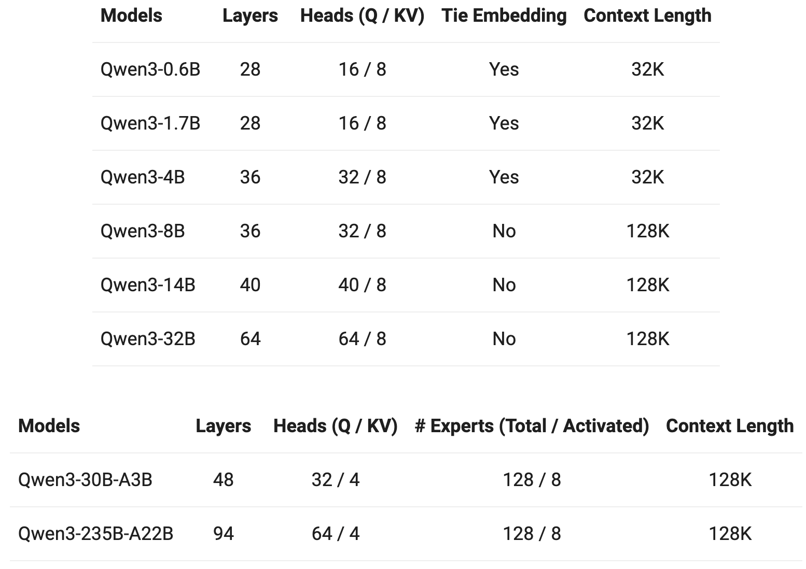
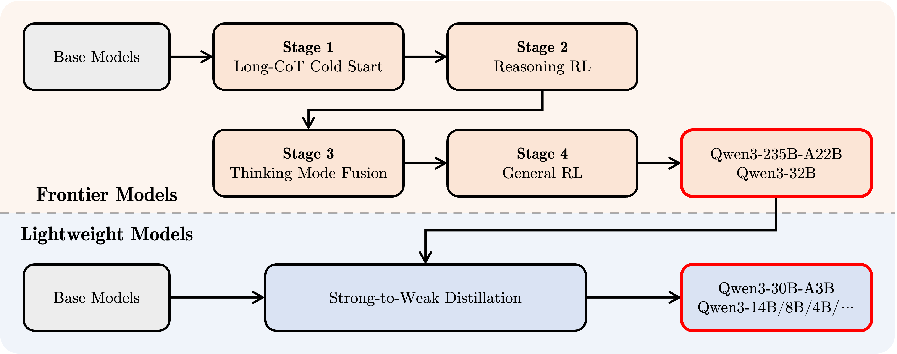

+++
date = '2025-04-30T15:01:24+08:00'
draft = true
title = 'Qwen3'
+++
[Chat](https://chat.qwen.ai/) · [Blog](https://qwenlm.github.io/blog/qwen3/) · [Hugging Face](https://huggingface.co/collections/Qwen/qwen3-67dd247413f0e2e4f653967f) · [GitHub](https://github.com/QwenLM/Qwen3) · [ModelScope](https://modelscope.cn/organization/qwen) · [HF-Demo](https://huggingface.co/spaces/Qwen/Qwen3-Demo) · [Doc-en](https://qwen.readthedocs.io/en/latest/) · [Doc-zh](https://qwen.readthedocs.io/zh-cn/latest/)

# Introduction


post-trained models, such as Qwen3-30B-A3B, along with their pre-trained counterparts (e.g.-30B-A3B-Base), are now available on platforms like Hugging Face, ModelScope, and Kaggle. 

# Key Features
- **Hybrid Thinking Modes**
    - Thinking Mode: In this mode, the model takes time to reason step by step before delivering the final answer. This is ideal for complex problems that require deeper thought.
    - Non-Thinking Mode: Here, the model provides quick, near-instant responses, suitable for simpler questions where speed is more important than depth.

- **Multilingual Support**
    - support 119 languages and dialects
- **Improved Agentic Capabilities**
    - We have optimized the Qwen3 models for coding and agentic capabilities, and also we have strengthened the support of **MCP** as well.

# Pre-training
In terms of pretraining, the dataset for Qwen3 (approximately 36 trillion tokens) has been significantly expanded compared to Qwen2.5 (18 trillion tokens).
## Dataset source
- web
- PDF-like documents
    - extract text from these documents with Qwen2.5-VL
    - improve the quality of the extracted content with Qwen2.5
- synthetic data
    - To increase the amount of math and code data, we used Qwen2.5-Math and Qwen2.5-Coder to generate synthetic data. 

## Training process
- Stage 1: 30 trillion tokens with a context length of 4K tokens. This stage provided the model with basic language skills and general knowledge.
- Stage 2: increasing the proportion of knowledge-intensive data, such as STEM, coding, and reasoning tasks. The model was then pretrained on an additional 5 trillion tokens.
- Stage 3: we used high-quality long-context data to extend the context length to 32K tokens. This ensures the model can handle longer inputs effectively.


# Post-training


## Training process
- Stage 1: long chain-of-thought (CoT) cold start
    - We fine-tuned the models using diverse long CoT data, covering various tasks and domains such as mathematics, coding, logical reasoning, and STEM problems. This process aimed to equip the model with fundamental reasoning abilities.
- Stage 2: reasoning-based reinforcement learning (RL)
    - focused on scaling up computational resources for RL, utilizing rule-based rewards to enhance the model's exploration and exploitation capabilities.
- Stage 3: thinking mode fusion
    - we integrated non-thinking capabilities into the thinking model by fine-tuning it on a combination of long CoT data and commonly used instruction-tuning data. This data was generated by the enhanced thinking model from the second stage, ensuring a seamless blend of reasoning and quick response capabilities.
- Stage 4: general RL
    - we applied RL across more than 20 general-domain tasks to further strengthen the model's general capabilities and correct undesired behaviors. These tasks included instruction following, format following, and agent capabilities, etc.

    
# Deployment
For deployment, we recommend using frameworks like SGLang(>=0.4.6.post1) and vLLM(>=0.8.4) to create an OpenAI-compatible API endpoint:
SGLang:
```python
python -m sglang.launch_server --model-path Qwen/Qwen3-30B-A3B --reasoning-parser qwen3
```
vLLM:
```python
vllm serve Qwen/Qwen3-30B-A3B --enable-reasoning --reasoning-parser deepseek_r1
```
For local usage, tools such as Ollama, LMStudio, MLX, llama.cpp, and KTransformers are highly recommended.

# Agentic Usages
We recommend using Qwen-Agent to make the best use of agentic ability of Qwen3.
To define the available tools, you can use the MCP configuration file, use the integrated tool of Qwen-Agent, or integrate other tools by yourself.