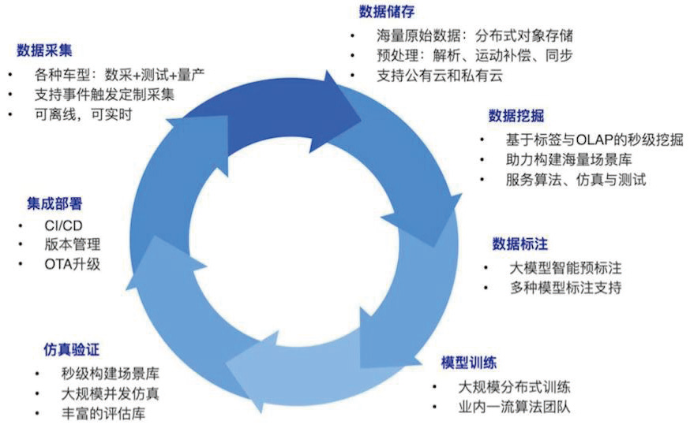

+++
date = '2025-06-16T15:29:16+08:00'
draft = true
title = 'AI-Powered Data-Centric Closed-Loop System'
categories = []
tags = []
+++

<!--  -->

<!-- 
flowchart TB
    %% Main Graph Structure
    subgraph Main["AI-Powered Data-Centric Closed-Loop System"]
        direction TB

        %% Business Process Flow
        subgraph Process["Data Processing Pipeline"]
            direction LR
            P1["数据采集"] --> P2["数据清洗"]
            P2 --> P3["数据挖掘"]
            P3 --> P4["数据标注"]
            P4 --> P5["模型训练"]
            P5 --> P6["仿真测试"]
            P6 --> P7["集成部署"]
            P7 -.-> P1
        end

        Process --> FM

        %% Foundation Models Layer
        subgraph FM["Foundation Models"]
            direction TB
            
            subgraph ClosedSet["Closed-Set Models"]
                direction TB
                subgraph CS2D["2D Models"]
                    direction TB
                    CS2D1["Object Detection"]
                    CS2D2["Two-stage Classification"]
                end
                subgraph CS4D["4D Models"]
                    direction TB
                    CS4D1["BEV-OD"]
                    CS4D2["BEV-Map"]
                end
            end

            subgraph OpenSet["Open-Vocabulary Models"]
                direction TB
                subgraph OS2D["2D Models"]
                    direction TB
                    OS2D1["Open-Vocabulary Detection"]
                    OS2D2["Open-Vocabulary Segmentation"]
                end
            end

            subgraph Understanding["Understanding Models"]
                direction TB
                U1["VQA"]
                U2["CLIP"]
            end

            subgraph Generation["Generative Models"]
                direction TB
                G1["3D Gaussian Splatting"]
                G2["NeRF"]
                G3["GANs"]
                G4["Diffusion Models"]
            end
        end
    end

    %% Styling
    classDef main fill:#ffffff,stroke:#333,stroke-width:2px
    classDef process fill:#f8f9fa,stroke:#333,stroke-width:2px
    classDef foundation fill:#e6f3ff,stroke:#333,stroke-width:2px
    classDef closedSet fill:#ffe6e6,stroke:#333,stroke-width:1px
    classDef openSet fill:#e6ffe6,stroke:#333,stroke-width:1px
    classDef openSet2D fill:#ccffcc,stroke:#333,stroke-width:1px
    classDef closedSet2D fill:#ffcccc,stroke:#333,stroke-width:1px
    classDef closedSet4D fill:#ffcccc,stroke:#333,stroke-width:1px
    classDef understanding fill:#e6e6ff,stroke:#333,stroke-width:1px
    classDef generation fill:#ffe6ff,stroke:#333,stroke-width:1px
    
    class Main main
    class Process process
    class P1,P2,P3,P4,P5,P6,P7 process
    class FM foundation
    class CS2D,CS4D closedSet
    class OS2D openSet
    class OS2D1,OS2D2 openSet2D
    class CS2D1,CS2D2 closedSet2D
    class CS4D1,CS4D2 closedSet4D
    class U1,U2 understanding
    class G1,G2,G3,G4 generation
 -->

**研发策略**
- 需求出发, AI驱动
- "专用小模型" -> "通用大模型"的范式进阶
- 

## Data Platform & Toolchain
高效性，稳定性，易用性

<!-- - AgentAI -->
<!-- - Airflow -->
<!-- - Milvus -->
平台架构设计

## Data Mining
- Foundation Models
    - Closed-Set Models
        - 2D 大模型 + 两阶段方案 (结合大模型)
        - 4D 大模型
            - BEV-OD
            - BEV-Map
    - Open-Vocabulary Models
        - 开集检测
        - 开集分割
    - Contrastive Learning
        - CLIPs
    - VQA
- 数据质量评估体系
    - 数据去重
    - 数据蒸馏
    - Active Learning
- Applications
    - 云端: 
        - Tag Retrieval System
            - Close-Set Models
            - Open-Vocabulary Models
            - Contrastive Learning
        - Multi-modal Retrieval System
            - Image-level
            - Patch-level
            - Instance-level
                - Close-Set Object BBox + CLIP
                - Open-Vocabulary Object BBox + CLIP
    - 车端: Shadow Mode【暂无需求】
    
## Auto-GT
- 2D
<!-- - 4D -->

## 后续研发方向
1. 4D大模型  
   - 离线BEV 大模型，接入 LiDAR, 接入未来帧，进一步大幅提升离线大模型性能。  
   - 离线BEV Map 上线应用  
2. 数据质量评估体系：从场景挖掘 -> 对模型有收益的数据挖掘  
3. Auto-GT-2D: 利用闭集/开集Foundation Model，完善自动化标注  
4. Image 检索 -> Video 检索  
5. NM 自己的数据集如何利用？  
6. 平台链路重构
7. 

<!-- ## Simulation
- Generative AI
    - 3D Gaussian Splatting (3DGS)
    - NeRF
    - GANs
    - Diffusion Models
- Applications
    - 仿真数据
        - 元素编辑
        - 场景迁移
        - 图像/视频生成
    - 世界模型&闭环仿真 -->